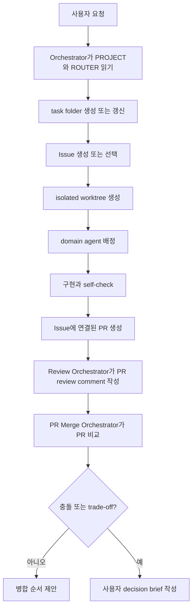

# 멀티에이전트 Issue, Worktree, PR 흐름

이 파일은 오케스트레이션 index다. 실제 명령이나 merge case가 필요할 때만 `agents/ref/pr-orchestration.md`를 연다.

## 핵심 규칙

기능 작업에서 agent가 shared main checkout에 바로 쓰게 하지 않는다.

각 구현 단위는 다음 흐름을 따른다.

```text
task folder -> Issue -> isolated worktree -> branch -> commit -> PR -> review comment -> merge decision
```

## 기본 흐름



## 하지 말 것

- task folder와 Issue 또는 issue draft 없이 구현을 시작하지 않는다.
- 독립 agent가 하나의 worktree를 공유하지 않는다.
- 명시적 orchestration 없이 두 agent가 같은 파일을 소유하지 않는다.
- PR을 도착 순서대로 병합하지 않는다.
- product, architecture, model-stack, destructive git conflict를 자동 해결하지 않는다.
- PR이 있으면 review output을 local log에만 묻지 않는다.

## agent 책임

| 역할 | 책임 |
|---|---|
| Orchestrator | task folder와 worker brief 생성 |
| Domain Agent | 하나의 Issue와 worktree 소유 |
| Review Orchestrator | PR을 리뷰하고 finding을 PR comment로 게시 |
| PR Merge Orchestrator | 열린 PR을 비교하고 병합 순서 제안 |
| Git Manager | branch/worktree 안전과 commit hygiene 관리 |
| Failure Recorder | 반복 실패와 실패한 접근 기록 |
| 사용자 | unresolved conflict와 trade-off 결정 |

## conflict escalation

다음 경우 사용자에게 올린다.

- 두 worker 또는 PR이 같은 contract를 다르게 변경한다.
- reviewer가 architecture 또는 correctness에서 의견이 갈린다.
- 병합 순서가 project scope를 바꾼다.
- 한 PR을 살리려면 다른 PR을 버려야 한다.
- model-stack 선택이 GPU/data/time 요구사항을 바꾼다.
- git history rewrite, branch deletion, destructive operation이 제안된다.

선택지는 `skills/decision-brief.md`로 제시한다.

## 상세 참고

실제 PR stack을 조율하거나 conflict를 해결할 때만 `agents/ref/pr-orchestration.md`를 연다.
