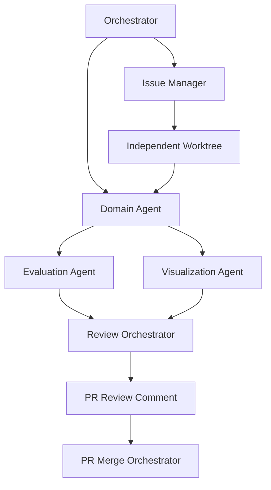
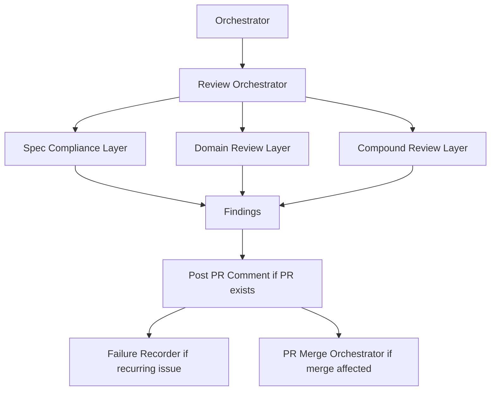
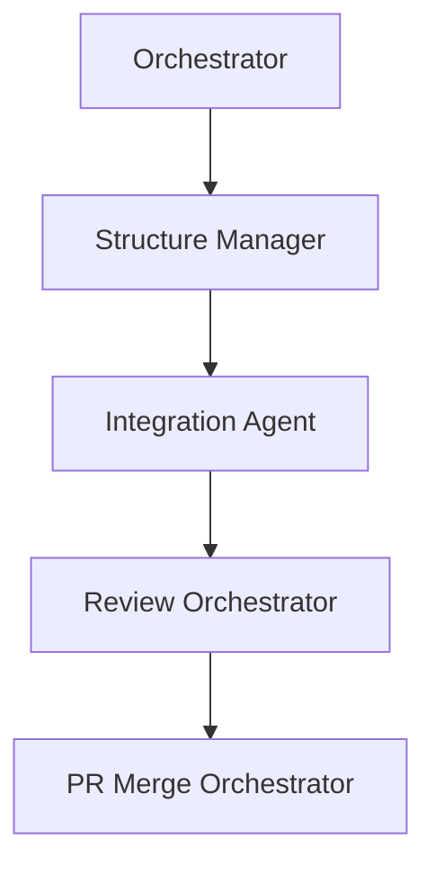
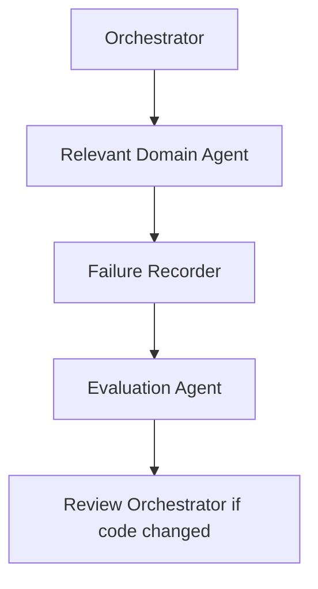

# 라우팅 패턴

command router의 한 줄 route만으로 부족할 때만 이 파일을 연다.

## Pattern A: 새 기능

domain agent가 Issue 생성을 건너뛰거나 worktree 밖에 쓰지 않게 한다.

## Pattern B: 코드 리뷰

모호한 review summary를 올리지 않는다. blocking finding에는 파일, 동작, merge 영향이 있어야 한다.

## Pattern C: 폴더 구조 또는 아키텍처 정리

파일을 옮길 때 routing, skill, import, reference를 함께 갱신한다.

## Pattern D: 실패 조사

재현 단계, 관찰된 출력, 다음에 반복하지 말 시도를 남기지 않은 failure 기록은 만들지 않는다.
