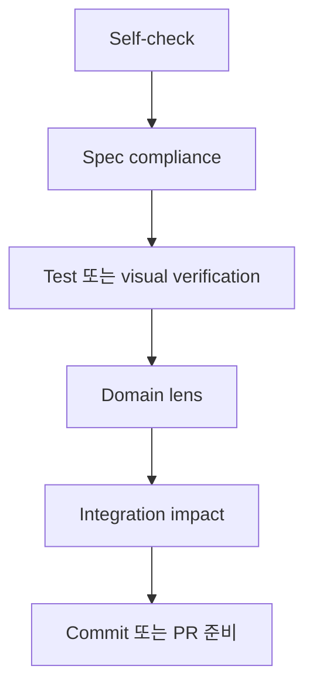

# 계층형 코드 리뷰 (상세)

이 파일은 계층형 리뷰의 상세 흐름과 계층 표를 담는 참고 문서다. 반복 적용되는 리뷰·검증 판단 기준은 `rules/review-and-verification.md`가 canonical이며, domain-specific checklist는 `rules/ref/review-lenses.md`를 연다.

## 핵심 규칙

코드 리뷰를 하나의 일반적인 pass로 취급하지 않는다. 낮은 계층에서 실패하면 상위 리뷰로 넘어가지 않는다.

## 건너뛰지 말 것

- spec과 다르면 style review로 넘어가지 않는다.
- test 또는 visual evidence가 없으면 “좋아 보임”으로 승인하지 않는다.
- geometry나 measurement 변경은 domain review 없이 넘기지 않는다.
- PR이 있으면 review finding을 PR comment로 남긴다.

## 리뷰 계층

| 계층 | 목적 | 멈출 조건 |
|---|---|---|
| Self-check | 구현자가 범위와 검증을 스스로 확인 | 구현자가 바뀐 파일을 설명하지 못함 |
| Spec compliance | Issue/task 요구사항과 맞는지 확인 | scope mismatch |
| Evidence | test, metric, screenshot, visual check 확인 | 검증 없음 |
| Domain lens | CV domain 오류 확인 | mask/geometry/measurement risk |
| Integration | 다음 agent와 output contract 확인 | downstream contract 깨짐 |

## domain lens trigger

- Segmentation: mask, tracking, confidence 변경
- Geometry: depth, pose, intrinsics, coordinate transform 변경
- Reconstruction: point cloud, fusion, TSDF 변경
- Object prior: bbox, dimension, orientation, placement 변경
- Evaluation: metric, ablation, threshold 변경
- Visualization: demo, report image, warning display 변경

## 스택 브랜치 가이드

작업이 큰 경우 작은 branch stack으로 나눈다. 각 branch는 독립적으로 리뷰 가능해야 한다.

domain별 자세한 checklist는 `rules/ref/review-lenses.md`에 둔다.
