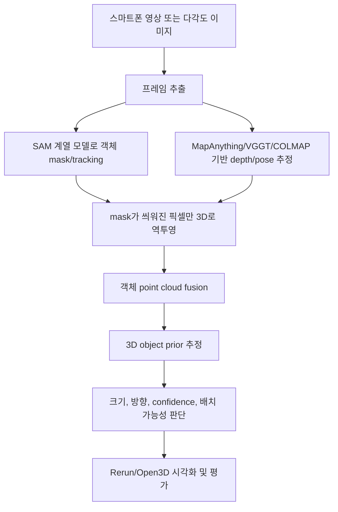

# Object3D Prior

SAM 계열 모델의 2D segmentation 결과를 3D 공간의 객체 정보로 확장해, 실제 물체의 추적, 측정, 방향 추정, 배치 가능성 판단을 수행하는 컴퓨터 비전 프로젝트입니다.

## 핵심 아이디어

일반적인 segmentation 데모는 이미지 안에서 객체 영역을 분리하는 데서 끝납니다. 이 프로젝트는 한 단계 더 나아가, SAM 계열 모델이 만든 mask를 depth, camera pose, point cloud와 결합해 **3D object prior**로 변환합니다.

즉, 단순히 “어디가 의자인가?”를 찾는 것이 아니라 다음 질문에 답하는 것을 목표로 합니다.

- 이 객체는 3D 공간에서 어디에 있는가?
- 객체의 width, depth, height는 대략 얼마인가?
- 객체는 어느 방향으로 놓여 있는가?
- 측정 결과를 얼마나 믿을 수 있는가?
- 이 객체 또는 비슷한 크기의 물체를 특정 공간에 배치할 수 있는가?

## 프로젝트 범위

초기 목표는 방 전체를 고밀도로 3D 복원하는 것이 아닙니다. 먼저 스마트폰 영상 속 **단일 객체**를 안정적으로 추적하고, 객체 단위 3D point cloud와 bounding box를 만드는 MVP에 집중합니다.

방 전체 reconstruction, 대규모 3D scene completion, 자체 3D 생성 모델 학습은 이후 확장 과제로 둡니다.

## 파이프라인



## 주요 기술

- **SAM / SAM 2 계열**: 객체 mask 생성과 video tracking
- **MapAnything / VGGT**: depth, camera pose, metric geometry 추정
- **COLMAP**: 전통적인 SfM/MVS baseline 및 geometry sanity check
- **OpenCV / NumPy / SciPy**: 카메라 기하, 좌표 변환, 수치 계산
- **Open3D / Rerun**: point cloud와 3D bounding box 시각화
- **PyTorch**: 모델 adapter 및 향후 실험 확장

## MVP 목표

첫 번째 안정 버전은 다음을 만족하는 것을 목표로 합니다.

- 스마트폰 영상에서 목표 객체 하나를 선택하고 추적
- frame별 mask overlay 확인
- depth/pose를 이용한 masked pixel back-projection
- 객체 단위 point cloud 생성
- oriented bounding box fitting
- width, depth, height 추정
- 수동 실측값과 오차 비교
- confidence와 실패 이유 표시

## 학습 전략

처음부터 모델을 학습하거나 fine-tuning하지 않습니다. 먼저 pretrained 모델 조합과 기하 파이프라인으로 no-training MVP를 완성한 뒤, 반복 실패가 확인되면 필요한 병목 하나만 데이터셋 기반으로 조정합니다.

초기 튜닝 대상은 mask threshold, frame filtering, point cloud outlier removal, bbox fitting, scale alignment입니다.

## 예상 디렉터리 구조

```text
src/
  capture/
  adapters/
  geometry/
  reconstruction/
  priors/
  evaluation/
  visualization/
  pipeline/
configs/
scripts/
tests/
docs/
```

현재 구현 코드는 `src/` 아래에 추가합니다.

## 제외되는 자료

수업 자료, 개인 계획 문서, 참고 논문 원본, 실험용 원본 데이터는 git에 포함하지 않습니다. 이 레포지토리는 공개 가능한 구현 코드, 설정, 테스트, 문서 중심으로 관리합니다.

## VGGT 실행 환경별 명령

실제 VGGT checkpoint smoke는 Mac MPS 단일 이미지 기준으로 통과했습니다. 현재 repo에는 VGGT prediction을 `geometry.npz`로 저장하는 adapter와 downstream prior 연결 경로가 있고, 실행 환경 준비 절차는 아래처럼 나눕니다.

자세한 기준은 [VGGT runtime environment runbook](docs/runbooks/20260526-vggt-runtime-environments.md)에 정리했습니다.

### 로컬 MacBook Pro M5 / Apple Silicon MPS

로컬 Mac은 CUDA가 아니라 PyTorch MPS backend를 사용합니다. VGGT 공식 quick start는 CUDA/CPU 중심이라, 로컬에서는 MPS 가능 여부 확인과 대표 fixture 1장 smoke를 첫 목표로 둡니다.

```bash
python3 -m venv .venv-vggt-mps
source .venv-vggt-mps/bin/activate
python -m pip install -U pip
python -m pip install torch torchvision torchaudio
python -m pip install numpy Pillow opencv-python scipy huggingface_hub

mkdir -p reference
git clone https://github.com/facebookresearch/vggt.git reference/vggt
python -m pip install -r reference/vggt/requirements.txt
python -m pip install -e reference/vggt

python - <<'PY'
import torch
print("mps available:", torch.backends.mps.is_available())
PY
```

### 학교 NVIDIA RTX 30/40 Series / CUDA

학교 GPU는 실제 VGGT inference의 기본 실행 환경입니다. RTX 4070 12GB급이면 1장으로 시작하고, 성공 뒤 2-4장까지 늘리는 흐름을 기본으로 둡니다.

```bash
nvidia-smi

python3 -m venv .venv-vggt-cuda
source .venv-vggt-cuda/bin/activate
python -m pip install -U pip
python -m pip install torch torchvision torchaudio \
  --index-url https://download.pytorch.org/whl/cu128
python -m pip install numpy Pillow opencv-python scipy huggingface_hub

mkdir -p reference
git clone https://github.com/facebookresearch/vggt.git reference/vggt
python -m pip install -r reference/vggt/requirements.txt
python -m pip install -e reference/vggt

python - <<'PY'
import torch
print("cuda available:", torch.cuda.is_available())
if torch.cuda.is_available():
    print("device:", torch.cuda.get_device_name(0))
PY
```

### 공통 downstream 확인

VGGT dependency와 checkpoint가 준비된 환경에서는 먼저 이미지 1장을 `geometry.npz`로 저장합니다.

```bash
PYTHONPATH=src python -m object3d.pipeline.generate_smoke_fixtures \
  --output-dir outputs/representative-smoke-fixtures

PYTHONPATH=src python -m object3d.pipeline.vggt_geometry \
  --image-path outputs/representative-smoke-fixtures/laptop/image.png \
  --output-path outputs/vggt-smoke/laptop/geometry.npz \
  --device cuda
```

`geometry.npz`가 있으면 기존 3D prior 단계는 그대로 이어집니다.
VGGT depth 해상도와 segmentation mask 해상도가 다르면 `prior_from_mask`가 mask를 geometry 해상도에 맞춰 자동 조정하고 summary에 기록합니다.

```bash
PYTHONPATH=src python -m object3d.pipeline.segment_image \
  --backend manual \
  --image-path outputs/representative-smoke-fixtures/laptop/image.png \
  --prompt-json outputs/representative-smoke-fixtures/laptop/prompt.json \
  --output-dir outputs/vggt-smoke/laptop/segmentation \
  --object-id laptop_001

PYTHONPATH=src python -m object3d.pipeline.prior_from_mask \
  --segmentation-summary outputs/vggt-smoke/laptop/segmentation/summary.json \
  --output-dir outputs/vggt-smoke/laptop/prior \
  --geometry-npz outputs/vggt-smoke/laptop/geometry.npz \
  --mask-cleanup largest_component \
  --mask-erode-pixels 1 \
  --outlier-filter radial_percentile \
  --outlier-keep-ratio 0.95
```

`--mask-cleanup largest_component`는 SAM2 mask에서 가장 큰 객체 덩어리만
남기고, `--mask-erode-pixels 1`은 경계를 살짝 안쪽으로 깎습니다. 즉,
노트북뿐 아니라 책상, 컵, 가구처럼 일반 물체를 3D로 올리기 전에 2D mask를
먼저 청소하는 단계입니다. 얇은 물체는 erosion으로 사라질 수 있으므로
`--mask-erode-pixels 0`으로 시작합니다.

## 현재 상태

현재는 no-training MVP의 end-to-end skeleton이 연결된 상태입니다.

구현된 흐름:

1. 이미지/영상 입력과 frame manifest
2. manual 또는 SAM2 segmentation
3. mock depth 또는 `.npz` file geometry 입력
4. mask cleanup과 masked back-projection
5. object point cloud outlier filtering과 oriented bbox
6. scene manifest와 Rerun recording 저장

다음 큰 작업은 object-aware multi-view fusion과 subpart segmentation입니다. 현재는 view별 3D prior를 만들 수 있지만, 일반 물체를 항상 깔끔한 하나의 3D 객체로 복원하려면 여러 view의 point cloud를 안정적으로 합치고, 열린 노트북처럼 꺾인 물체를 부분 객체로 나누는 단계가 필요합니다.
