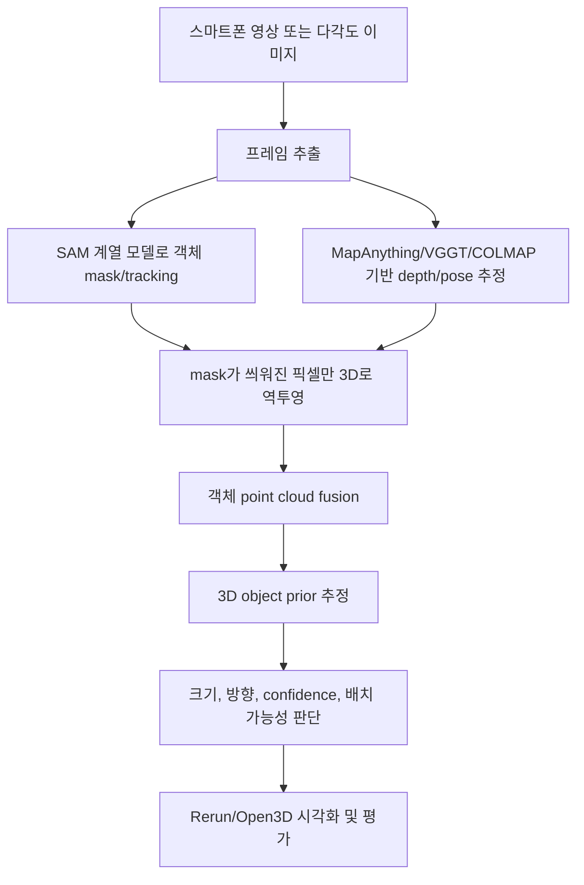

# Object3D Prior

SAM 계열 모델의 2D segmentation 결과를 3D 공간의 객체 정보로 확장해, 실제 물체의 추적, 측정, 방향 추정, 배치 가능성 판단을 수행하는 컴퓨터 비전 프로젝트입니다.

## 핵심 아이디어

일반적인 segmentation 데모는 이미지 안에서 객체 영역을 분리하는 데서 끝납니다. 이 프로젝트는 한 단계 더 나아가, SAM 계열 모델이 만든 mask를 depth, camera pose, point cloud와 결합해 **3D object prior**로 변환합니다.

즉, 단순히 “어디가 의자인가?”를 찾는 것이 아니라 다음 질문에 답하는 것을 목표로 합니다.

- 이 객체는 3D 공간에서 어디에 있는가?
- 객체의 width, depth, height는 대략 얼마인가?
- 객체는 어느 방향으로 놓여 있는가?
- 측정 결과를 얼마나 믿을 수 있는가?
- 이 객체 또는 비슷한 크기의 물체를 특정 공간에 배치할 수 있는가?

## 프로젝트 범위

초기 목표는 방 전체를 고밀도로 3D 복원하는 것이 아닙니다. 먼저 스마트폰 영상 속 **단일 객체**를 안정적으로 추적하고, 객체 단위 3D point cloud와 bounding box를 만드는 MVP에 집중합니다.

방 전체 reconstruction, 대규모 3D scene completion, 자체 3D 생성 모델 학습은 이후 확장 과제로 둡니다.

## 파이프라인



## 주요 기술

- **SAM / SAM 2 계열**: 객체 mask 생성과 video tracking
- **MapAnything / VGGT**: depth, camera pose, metric geometry 추정
- **COLMAP**: 전통적인 SfM/MVS baseline 및 geometry sanity check
- **OpenCV / NumPy / SciPy**: 카메라 기하, 좌표 변환, 수치 계산
- **Open3D / Rerun**: point cloud와 3D bounding box 시각화
- **PyTorch**: 모델 adapter 및 향후 실험 확장

## MVP 목표

첫 번째 안정 버전은 다음을 만족하는 것을 목표로 합니다.

- 스마트폰 영상에서 목표 객체 하나를 선택하고 추적
- frame별 mask overlay 확인
- depth/pose를 이용한 masked pixel back-projection
- 객체 단위 point cloud 생성
- oriented bounding box fitting
- width, depth, height 추정
- 수동 실측값과 오차 비교
- confidence와 실패 이유 표시

## 학습 전략

처음부터 모델을 학습하거나 fine-tuning하지 않습니다. 먼저 pretrained 모델 조합과 기하 파이프라인으로 no-training MVP를 완성한 뒤, 반복 실패가 확인되면 필요한 병목 하나만 데이터셋 기반으로 조정합니다.

초기 튜닝 대상은 mask threshold, frame filtering, point cloud outlier removal, bbox fitting, scale alignment입니다.

## 예상 디렉터리 구조

```text
src/
  capture/
  adapters/
  geometry/
  reconstruction/
  priors/
  evaluation/
  visualization/
  pipeline/
configs/
scripts/
tests/
docs/
```

현재 구현 코드는 `src/` 아래에 추가합니다.

## 제외되는 자료

수업 자료, 개인 계획 문서, 참고 논문 원본, 실험용 원본 데이터는 git에 포함하지 않습니다. 이 레포지토리는 공개 가능한 구현 코드, 설정, 테스트, 문서 중심으로 관리합니다.

## 현재 상태

초기 설계 및 구현 준비 단계입니다. 우선순위는 다음과 같습니다.

1. 단일 객체 촬영 프로토콜 정의
2. SAM 계열 segmentation/tracking adapter 구성
3. depth/pose adapter 구성
4. masked point cloud 생성
5. object prior fitting과 측정 평가
