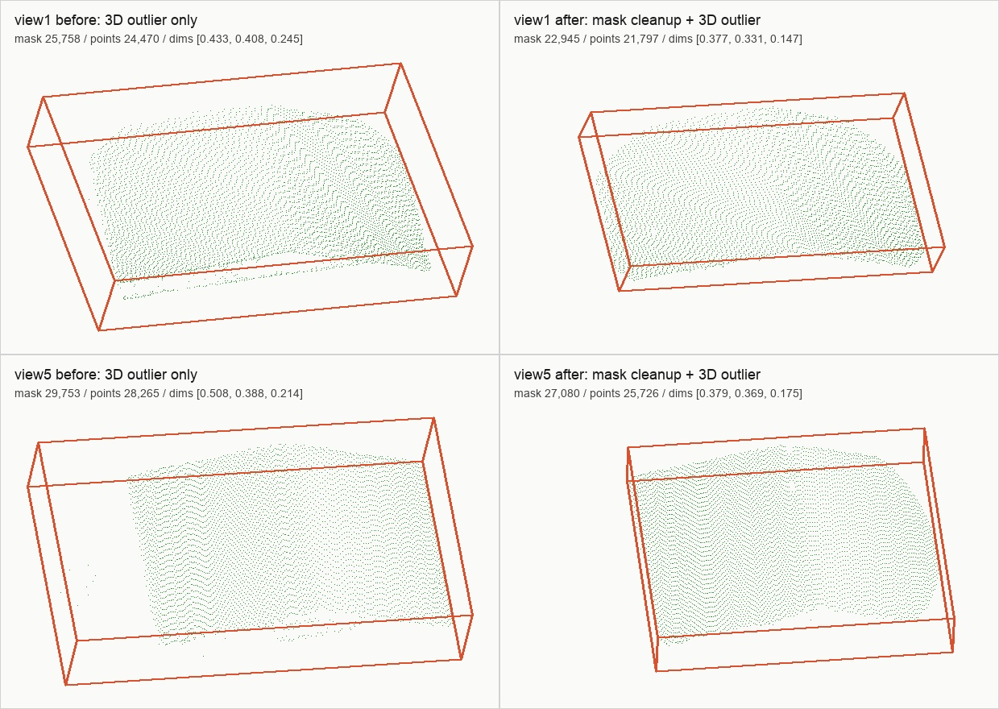

# General SAM2 3D Cleanup Smoke

> Scope: #56 / T20. 기존 실제 노트북 5-view 산출물에 일반 객체용 mask cleanup preset을 적용해, SAM2 mask의 작은 누수와 3D tail point가 줄어드는지 확인했다.

## 결론

**개선됨.** `prior_from_mask`에서 3D back-projection 전에 `largest_component`와 `erode 1`을 적용하고, 기존 `radial_percentile` 3D outlier filter를 함께 사용했다.

이 smoke는 노트북 사진을 재사용했지만, 구현은 노트북 전용이 아니다. 같은 옵션은 책상, 컵, 가구 등 일반 물체의 SAM2 mask에도 적용할 수 있다.

## 실행 옵션

```bash
PYTHONPATH=src .venv/bin/python -m object3d.pipeline.prior_from_mask \
  --segmentation-summary outputs/real-laptop-multiview-validation/view1/segmentation/summary.json \
  --output-dir outputs/real-laptop-multiview-validation/view1/prior_cleaned \
  --geometry-npz outputs/real-laptop-multiview-validation/geometry_fewview/view1/geometry.npz \
  --mask-cleanup largest_component \
  --mask-erode-pixels 1 \
  --outlier-filter radial_percentile \
  --outlier-keep-ratio 0.95
```

## 결과 이미지

아래 이미지는 원본 사진이 아니라, 기존 3D outlier filter만 쓴 결과와 mask cleanup까지 적용한 결과의 정적 3D preview다. view1과 view5는 기존 T19에서 테이블/배경 누수가 비교적 크게 보였던 케이스다.



## 수치 비교

| view | 기존 mask px | cleanup 후 mask px | 제거된 mask px | 기존 filtered points | cleanup 후 filtered points | 기존 dimensions_m | cleanup 후 dimensions_m |
|---|---:|---:|---:|---:|---:|---:|---:|
| 1 | 25,758 | 22,945 | 2,813 | 24,470 | 21,797 | `[0.433, 0.408, 0.245]` | `[0.377, 0.331, 0.147]` |
| 2 | 13,135 | 11,946 | 1,189 | 12,478 | 11,348 | `[0.334, 0.248, 0.042]` | `[0.322, 0.252, 0.017]` |
| 3 | 26,108 | 25,164 | 944 | 24,802 | 23,905 | `[0.395, 0.383, 0.188]` | `[0.387, 0.336, 0.187]` |
| 4 | 19,691 | 18,170 | 1,521 | 18,706 | 17,261 | `[0.375, 0.330, 0.135]` | `[0.370, 0.327, 0.133]` |
| 5 | 29,753 | 27,080 | 2,673 | 28,265 | 25,726 | `[0.508, 0.388, 0.214]` | `[0.379, 0.369, 0.175]` |

view1과 view5에서 bbox가 크게 줄었다. 이는 테이블/배경 tail이 일부 제거되었다는 신호다. view2는 가장 얇은 축이 더 줄었는데, 이 경우 erosion이 실제 노트북 경계도 조금 깎았을 가능성이 있어 `erode 0`과 비교할 후보로 남긴다.

## 해석

이번 개선은 “점이 튀는 것”을 두 단계로 줄인다.

1. 2D mask cleanup
   - 떨어진 작은 조각을 제거한다.
   - 경계에 붙은 얇은 배경 누수를 줄인다.
2. 3D outlier filtering
   - depth를 타고 올라간 뒤 중심에서 멀리 떨어진 tail point를 제거한다.

하지만 이것만으로 모든 물체가 완전히 깨끗해지는 것은 아니다. 물체와 배경이 mask 안에서 하나의 연결 덩어리로 붙어 있으면 `largest_component`가 분리하지 못한다. 투명 컵이나 반사 화면처럼 depth 자체가 흔들리는 물체도 별도 risk set으로 계속 관리해야 한다.
