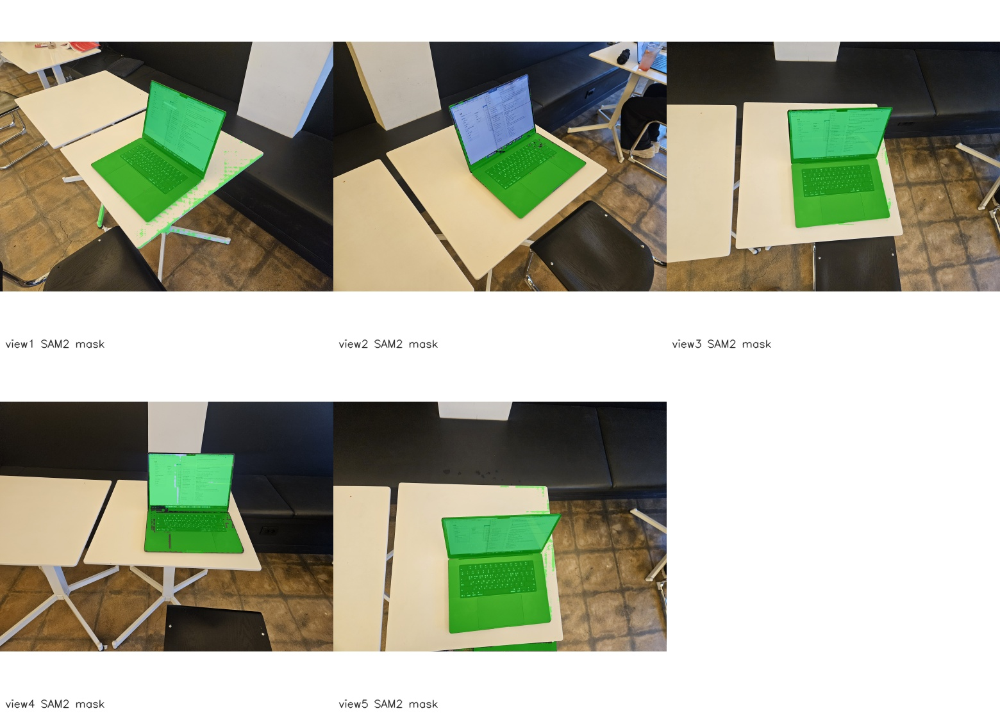
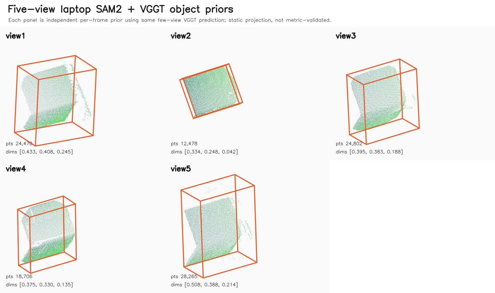

# Real Laptop Multi-View VGGT Validation

> Scope: T19. 사용자 제공 노트북 사진 5장을 대상으로 SAM2 segmentation, VGGT few-view geometry, outlier-filtered 3D prior를 실행해 “일반적으로 물체를 깔끔하게 분리해 3D로 뽑을 수 있는가”를 점검했다.

## 결론

**아직 일반적으로 깔끔한 3D object extraction이라고 보기는 어렵다.**

좋은 점:

- VGGT는 5장 few-view 입력을 한 번에 처리했고, 각 frame의 `geometry.npz`를 만들 수 있었다.
- SAM2는 대부분의 view에서 노트북 본체/화면을 대체로 잡았다.
- `prior_from_mask --geometry-npz --outlier-filter radial_percentile`는 5장 모두에서 끝까지 통과했다.

문제점:

- view별 mask 품질이 균일하지 않다. view1/view5는 테이블 일부가 같이 들어갔다.
- 같은 노트북인데 bbox dimensions가 view마다 크게 흔들린다.
- 현재 pipeline은 multi-view VGGT prediction을 사용하지만, object point cloud를 여러 frame에서 하나로 정합/fusion하지 않는다.
- 열린 노트북은 화면과 본체가 꺾인 두 평면 구조라 단일 oriented bbox 하나로 표현하기 어렵다.

따라서 현재 수준은 **“각 view에서 객체 후보 point cloud를 만들 수 있다”**에 가깝고, **“일반적인 물체를 안정적으로 깔끔한 3D 객체로 복원한다”**까지는 아니다.

## 입력

- 대상: 책상 위 열린 노트북
- 입력 사진: `20260526_185530.jpg`, `20260526_185534.jpg`, `20260526_185537.jpg`, `20260526_185539.jpg`, `20260526_185542.jpg`
- git에는 원본 사진을 커밋하지 않았다.
- macOS 권한 문제를 피하기 위해 로컬에서 `outputs/real-laptop-multiview-validation/input/` 아래로 복사해 사용했다.

## 실행 흐름

```text
5장 노트북 사진
  -> VGGT few-view inference 1회
  -> view별 geometry.npz 저장
  -> view별 SAM2 mask
  -> prior_from_mask --geometry-npz --outlier-filter radial_percentile
  -> view별 point cloud / oriented bbox / Rerun .rrd
```

VGGT prediction shape:

```text
depth_map: [5, 392, 518, 1]
intrinsic: [5, 3, 3]
extrinsic: [5, 3, 4]
```

## SAM2 결과

아래 이미지는 원본 사진이 아니라, view별 SAM2 overlay를 downscale해서 묶은 검증용 contact sheet다.



관찰:

- view2, view3, view4는 노트북 영역을 비교적 잘 잡았다.
- view1은 책상 가장자리와 다리/배경 쪽 점들이 일부 섞였다.
- view5는 노트북 뒤쪽 테이블 영역이 mask에 같이 들어갔다.
- 화면 반사, 검은 베젤, 어두운 본체와 검은 소파 배경이 경계를 어렵게 만든다.

## 3D 결과

아래 이미지는 view별 outlier-filtered point cloud와 oriented bbox를 같은 projection으로 묶은 정적 preview다.



수치 비교:

| view | SAM2 confidence | original mask px | filtered points | removed | dimensions_m | volume candidate |
|---|---:|---:|---:|---:|---:|---:|
| 1 | 0.857 | 1,519,920 | 24,470 | 1,288 | `[0.433, 0.408, 0.245]` | 0.0434 |
| 2 | 0.853 | 776,675 | 12,478 | 657 | `[0.334, 0.248, 0.042]` | 0.0035 |
| 3 | 0.898 | 1,542,223 | 24,802 | 1,306 | `[0.395, 0.383, 0.188]` | 0.0284 |
| 4 | 0.831 | 1,163,444 | 18,706 | 985 | `[0.375, 0.330, 0.135]` | 0.0167 |
| 5 | 0.849 | 1,755,399 | 28,265 | 1,488 | `[0.508, 0.388, 0.214]` | 0.0422 |

같은 노트북인데 largest bbox axis가 `0.334m`에서 `0.508m`까지 흔들린다. 최소 축은 `0.042m`에서 `0.245m`까지 더 크게 흔들린다. 이는 아직 metric scale이나 3D shape가 안정적이지 않다는 뜻이다.

## 왜 깨끗하게 안 되는가

### 1. Segmentation이 완벽하지 않다

SAM2는 view별로 대체로 노트북을 잡지만, 테이블과 배경이 일부 섞인다. 특히 노트북과 책상이 색/밝기 면에서 붙어 보이는 부분, 화면 반사, 검은 베젤과 검은 소파가 맞닿는 부분에서 경계가 불안정하다.

### 2. 열린 노트북은 단일 cuboid가 아니다

노트북은 화면 평면과 키보드/본체 평면이 꺾인 구조다. 현재는 object point cloud 전체에 PCA oriented bbox 하나를 맞춘다. 그래서 화면 각도, 보이는 면, mask tail에 따라 bbox 축이 크게 흔들린다.

### 3. VGGT depth는 view별 visible surface 중심이다

각 view에서 실제로 보이는 표면만 point cloud가 된다. 보이지 않는 뒷면, 바닥면, 가려진 경계는 복원되지 않는다. 따라서 view마다 point cloud shape가 달라지고, bbox도 달라진다.

### 4. Multi-view fusion이 아직 object-aware하지 않다

VGGT는 5장을 같이 보고 depth/pose를 예측했지만, 현재 pipeline은 view별 `geometry.npz`와 view별 mask를 각각 처리한다. 여러 view의 object point cloud를 같은 object coordinate로 robust하게 합치고 중복/충돌을 정리하는 단계가 아직 없다.

### 5. Metric scale 검증이 없다

`dimensions_m`은 아직 실제 노트북 치수와 비교하지 않았다. 따라서 값은 상대 비교와 instability 확인용이지, 실제 길이로 믿으면 안 된다.

## 판단

현재 pipeline은 다음에는 충분히 쓸 수 있다.

- 실제 사진에서 객체 후보 mask 생성
- VGGT depth/pose를 이용한 per-view object point cloud 생성
- outlier-filtered bbox 후보 생성
- 실패 원인을 segmentation / depth / bbox / fusion 문제로 분리

하지만 다음에는 아직 부족하다.

- 일반 물체를 자동으로 깔끔하게 3D mesh/object로 복원
- 열린 노트북처럼 꺾인 구조를 단일 bbox로 안정 표현
- view가 바뀌어도 동일한 metric dimensions 산출
- 배경과 붙은 물체를 완전 자동으로 안정 분리

## 다음 작업

1. Object-aware multi-view fusion을 추가한다.
   - view별 point cloud를 camera pose로 같은 world frame에 모은다.
   - 같은 object id의 points를 합친 뒤 density/outlier filtering을 다시 수행한다.
2. Open laptop을 screen/body subparts로 나눈다.
   - `laptop_screen`, `laptop_base` 두 object prior로 분리하면 bbox가 훨씬 안정될 가능성이 크다.
3. 실제 치수 evaluation을 추가한다.
   - 노트북 width/depth/screen height를 수동 측정하고, view별/merged bbox와 비교한다.
4. Prompt policy를 강화한다.
   - negative points를 더 체계화하고, table/background leakage를 자동 감지한다.
