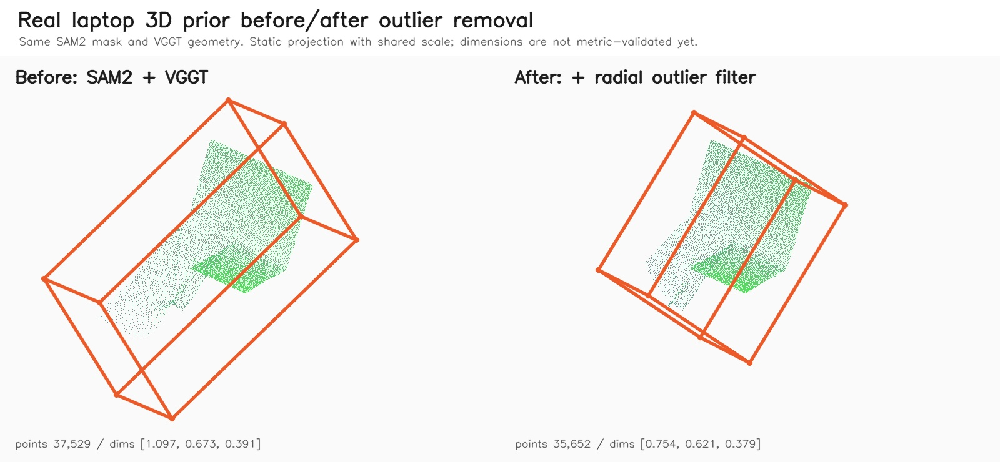

# Real Laptop Point Cloud Outlier Filter Smoke

> Scope: T18. T17의 실제 노트북 SAM2 + VGGT 결과에 point cloud outlier removal을 적용해, 튀는 3D 점이 oriented bbox를 과하게 키우는 문제를 줄이는지 확인했다.

## 결론

**개선됨.** 같은 SAM2 mask와 같은 VGGT `geometry.npz`를 사용하고, bbox fitting 직전에 radial percentile outlier filter를 적용했다.

점은 5.0%만 제거했지만, bbox 최대 축은 31.2%, bbox 부피 후보는 38.5% 줄었다.

이번 검증의 의미는 "실제 노트북 치수와 일치했다"가 아니라, **단일 이미지 VGGT depth에서 나온 꼬리 점들이 bbox를 크게 끌고 가는 문제를 완화했다**는 것이다.

## 적용한 방법

`prior_from_mask`에 optional outlier filter를 추가했다.

```bash
PYTHONPATH=src .venv/bin/python -m object3d.pipeline.prior_from_mask \
  --segmentation-summary outputs/real-laptop-sam2-mask-smoke/image1/segmentation/summary.json \
  --output-dir outputs/real-laptop-outlier-filter-smoke/image1/prior \
  --geometry-npz outputs/real-laptop-vggt-smoke/image1/geometry.npz \
  --outlier-filter radial_percentile \
  --outlier-keep-ratio 0.95
```

쉽게 말하면, point cloud의 중앙 근처를 기준으로 가장 멀리 떨어진 5% 꼬리 점을 제거한 뒤 bbox를 다시 맞춘다.

## 시각 결과

아래 이미지는 원본 사진이 아니라, 동일한 SAM2 mask + VGGT geometry에서 outlier filter 적용 전/후 3D preview를 같은 scale로 비교한 검증 이미지다.



왼쪽은 SAM2 mask만 적용한 결과이고, 오른쪽은 radial percentile filter를 추가한 결과다. 필터 후에는 왼쪽 아래로 길게 끌리던 point tail이 줄고 bbox가 더 조밀해진다.

## 수치 비교

| 항목 | SAM2 + VGGT | + outlier filter | 변화 |
|---|---:|---:|---:|
| point count | 37,529 | 35,652 | -5.0% |
| removed points | 0 | 1,877 | +1,877 |
| keep ratio | 1.00 | 0.95 | - |
| dimensions_m | `[1.097, 0.673, 0.391]` | `[0.754, 0.621, 0.379]` | 감소 |
| largest bbox axis | 1.097 | 0.754 | -31.2% |
| bbox volume candidate | 0.289 | 0.177 | -38.5% |
| geometry depth shape | `392 x 518` | `392 x 518` | 동일 |

`dimensions_m`과 volume은 아직 실제 물체 치수나 실제 부피가 아니다. 현재는 같은 입력에서 bbox가 outlier에 덜 끌리는지를 보는 상대 지표로만 사용한다.

## Summary 기록

필터를 켜면 `prior/summary.json`에 다음 필드가 추가된다.

```json
{
  "outlier_filter": "radial_percentile",
  "outlier_keep_ratio": 0.95,
  "input_point_count": 37529,
  "filtered_point_count": 35652,
  "removed_point_count": 1877
}
```

기본값은 `--outlier-filter none`이라 기존 smoke와 테스트의 동작은 유지된다.

## 산출물

로컬 산출물은 `outputs/` 아래에만 있고 git에는 커밋하지 않는다.

```text
outputs/real-laptop-outlier-filter-smoke/image1/prior/summary.json
outputs/real-laptop-outlier-filter-smoke/image1/prior/scene_manifest.json
outputs/real-laptop-outlier-filter-smoke/image1/prior/laptop-sam2-vggt-filtered-smoke.rrd
```

git에 포함한 것은 작은 before/after preview 이미지 하나뿐이다.

```text
docs/validation/assets/20260526-real-laptop-outlier-filter-3d-comparison.jpg
```

## 남은 한계

- radial percentile은 단순하고 보수적인 필터다. 얇은 구조나 실제로 긴 물체에는 과하게 자를 수 있다.
- 단일 이미지 VGGT depth 자체의 휘어짐은 완전히 해결하지 못한다.
- 아직 실제 노트북 치수와 비교하지 않았으므로 metric correctness 검증은 아니다.

## 다음 작업

1. Image #1/#3/#4 multi-view VGGT smoke를 실행한다.
2. 실제 노트북 width/depth/height를 측정해 bbox dimensions와 비교한다.
3. 필요하면 filter 방식별 comparison을 추가한다.
