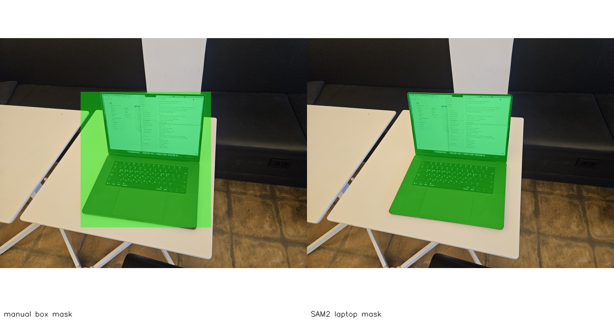

# Real Laptop SAM2 + VGGT Mask Smoke

> Scope: T17. PR #49의 VGGT smoke troubleshooting follow-up 위에서, 실제 노트북 사진에 SAM2 mask를 적용해 manual box보다 downstream 3D prior가 더 타이트해지는지 확인했다.

## 결론

**성공.** 같은 실제 노트북 사진과 같은 VGGT `geometry.npz`를 사용했을 때, SAM2 mask가 manual box보다 책상/배경 픽셀을 덜 포함했다.

이번 검증의 의미는 "노트북 치수를 정확히 복원했다"가 아니라, **manual box 때문에 커졌던 mask/point cloud를 SAM2 mask로 줄일 수 있는지 확인**한 것이다.

## 입력

- 대상: 책상 위 노트북 전체
- 선택 사진: Image #1, 로컬 원본 `/Users/kimgt/Downloads/20260526_185528.jpg`
- git에는 원본 사진을 커밋하지 않았다.
- 로컬 실행 입력은 `outputs/real-laptop-vggt-smoke/input/laptop_image1.jpg`를 재사용했다.
- VGGT geometry는 이전 smoke의 `outputs/real-laptop-vggt-smoke/image1/geometry.npz`를 재사용했다.

## Prompt

SAM2 prompt는 laptop 전체를 감싸는 box와 positive/negative point를 함께 사용했다.

```json
{
  "box_xyxy": [1040, 620, 2740, 2500],
  "point_coords_xy": [[1850, 1320], [1900, 2100], [840, 1000], [2960, 2040]],
  "point_labels": [1, 1, 0, 0],
  "multimask_output": true
}
```

쉽게 말하면, 첫 두 점은 "이쪽은 노트북"이고 마지막 두 점은 "이쪽은 배경"이라고 알려준 것이다.

## 실행 흐름

```text
실제 노트북 사진
  -> segment_image --backend sam2
  -> SAM2 mask / overlay
  -> prior_from_mask --geometry-npz
  -> point cloud / oriented bbox / scene manifest
  -> Rerun .rrd
```

## 시각 결과

아래 이미지는 원본 사진이 아니라, manual box overlay와 SAM2 overlay를 downscale해서 묶은 검증용 contact sheet다.



왼쪽 manual box는 사각형 내부의 책상 영역을 크게 포함한다. 오른쪽 SAM2 mask는 노트북 화면/키보드/본체 윤곽에 더 붙는다.

## 수치 비교

| 항목 | Manual box | SAM2 mask | 변화 |
|---|---:|---:|---:|
| 원본 mask pixels | 3,009,000 | 2,217,205 | -26.3% |
| VGGT geometry effective mask pixels | 51,051 | 37,529 | -26.5% |
| point count | 51,051 | 37,529 | -26.5% |
| dimensions_m | `[1.291, 1.159, 0.660]` | `[1.097, 0.673, 0.391]` | 감소 |
| mask alignment | resized to geometry | resized to geometry | 동일 |
| geometry depth shape | `392 x 518` | `392 x 518` | 동일 |

`dimensions_m`은 아직 실제 노트북 치수로 해석하지 않는다. 하지만 같은 depth 입력에서 mask가 타이트해지면서 point cloud와 bbox가 같이 줄었다는 점은 확인했다.

## 산출물

로컬 산출물은 `outputs/` 아래에만 있고 git에는 커밋하지 않는다.

```text
outputs/real-laptop-sam2-mask-smoke/image1/segmentation/summary.json
outputs/real-laptop-sam2-mask-smoke/image1/segmentation/overlay.png
outputs/real-laptop-sam2-mask-smoke/image1/prior/summary.json
outputs/real-laptop-sam2-mask-smoke/image1/prior/scene_manifest.json
outputs/real-laptop-sam2-mask-smoke/image1/prior/laptop-sam2-vggt-smoke.rrd
```

git에 포함한 것은 작은 비교 이미지 하나뿐이다.

```text
docs/validation/assets/20260526-real-laptop-sam2-vggt-mask-comparison.jpg
```

## 확인된 한계

- SAM2 mask가 좋아져도 단일 이미지 VGGT depth 자체의 찢김/휘어짐은 남을 수 있다.
- 노트북 화면 반사와 검은 베젤 경계 때문에 screen/body boundary는 아직 완벽하지 않다.
- bbox는 outlier에 민감하므로 다음 단계에서 point cloud outlier removal이 필요하다.

## 다음 작업

1. SAM2 mask 기반 point cloud에 outlier removal을 추가한다.
2. Image #1/#3/#4 multi-view VGGT smoke를 시도한다.
3. 실제 노트북 치수를 잰 뒤 bbox dimensions와 비교하는 evaluation으로 넘어간다.
