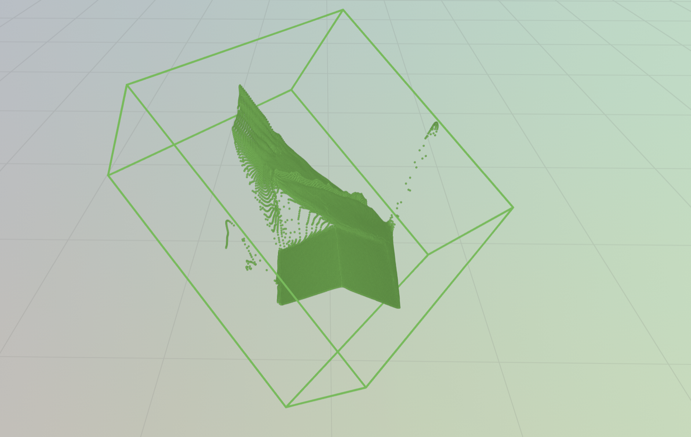

# Real Laptop VGGT MPS Smoke

> Scope: T16 / issue #46. 사용자 제공 노트북 사진 1장으로 MacBook MPS에서 실제 VGGT inference가 downstream 3D prior까지 이어지는지 확인했다.

## 결론

**성공.** MacBook MPS 환경에서 실제 VGGT checkpoint를 사용해 `geometry.npz`를 만들고, manual mask와 결합해 `prior_from_mask --geometry-npz` 및 Rerun recording 저장까지 완료했다.

다만 결과 point cloud 품질은 아직 거칠다. 이번 검증의 의미는 "정확한 노트북 3D 모델을 얻었다"가 아니라, **실제 VGGT depth/pose가 우리 파이프라인 끝까지 연결됐다**는 것이다.

## 입력

- 대상: 책상 위 노트북 전체
- 선택 사진: Image #1, 로컬 원본 `/Users/kimgt/Downloads/20260526_185528.jpg`
- git에는 원본 사진을 커밋하지 않았다.
- macOS 권한 문제를 피하기 위해 로컬에서 `outputs/real-laptop-vggt-smoke/input/laptop_image1.jpg`로 복사해 사용했다.

## 실행 환경

- MacBook Pro / Apple Silicon MPS
- Python 3.11 venv: `.venv-vggt-mps`
- VGGT model: `facebook/VGGT-1B`
- `PYTORCH_ENABLE_MPS_FALLBACK=1`
- Rerun viewer 전용 venv: `.venv-rerun`

## 실행 흐름

```text
실제 노트북 사진
  -> object3d.pipeline.vggt_geometry --device mps
  -> geometry.npz(depth_m, intrinsics, camera_to_world)
  -> manual segmentation
  -> prior_from_mask --geometry-npz
  -> point cloud / oriented bbox / scene manifest
  -> Rerun .rrd
```

## 산출물

로컬 산출물은 `outputs/` 아래에만 있고 git에는 커밋하지 않는다.

```text
outputs/real-laptop-vggt-smoke/image1/geometry.npz
outputs/real-laptop-vggt-smoke/image1/geometry.summary.json
outputs/real-laptop-vggt-smoke/image1/segmentation_518x392/overlay.png
outputs/real-laptop-vggt-smoke/image1/prior/summary.json
outputs/real-laptop-vggt-smoke/image1/prior/scene_manifest.json
outputs/real-laptop-vggt-smoke/image1/prior/laptop-vggt-smoke.rrd
```

## 수치 요약

`prior/summary.json` 기준:

| 항목 | 값 |
|---|---:|
| geometry source | `npz` |
| mask alignment | resized to geometry shape |
| geometry depth shape | `392 x 518` |
| effective mask shape | `392 x 518` |
| mask pixels | `51040` |
| point count | `51040` |
| dimensions_m | `[1.297, 1.234, 0.661]` |

`dimensions_m`은 아직 실제 노트북 치수로 해석하지 않는다. 단일 이미지, manual box mask, outlier removal 없음, scale 검증 전 단계라서 값이 과장될 수 있다.

## 시각 결과

Rerun에서 point cloud와 oriented bbox가 열리는 것을 확인했다.



화면이 찢어지거나 bbox가 크게 보이는 이유:

- 단일 이미지만 사용해 depth가 불안정하다.
- manual box mask는 노트북 윤곽이 아니라 사각형 전체를 포함한다.
- 책상/배경 픽셀이 point cloud에 일부 들어간다.
- PCA oriented bbox는 outlier에 민감하다.

## 확인된 문제와 반영

- VGGT가 만든 depth shape는 `392 x 518`이었다.
- 처음에는 원본 `3000 x 4000` mask를 넣어 `mask and depth must have the same shape` 오류가 났다.
- 이후 코드에서 mask와 depth shape가 다르면 mask를 geometry shape로 자동 resize하도록 반영했다.
- Rerun은 VGGT venv와 dependency가 충돌하므로 `.venv-rerun`으로 분리했다.

상세 실수 기록은 `docs/runbooks/20260526-vggt-smoke-troubleshooting.md`에 남긴다.

## 다음 작업

1. SAM2 mask로 노트북 윤곽을 더 정확히 자른다.
2. point cloud outlier removal을 추가한다.
3. Image #1, #3, #4 multi-view VGGT smoke를 시도한다.
4. 대표 물체 실측값과 bbox 치수를 비교하는 evaluation으로 넘어간다.
